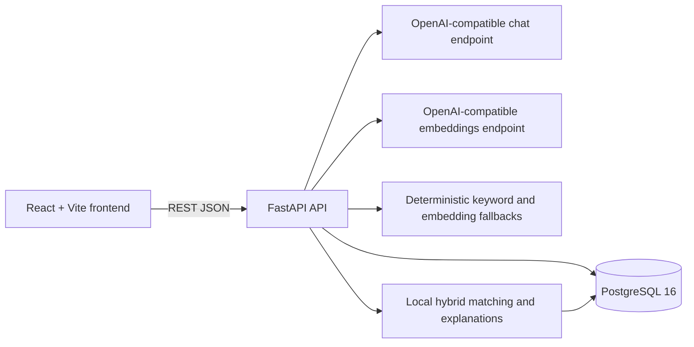

# Aatmoday Connect

**Find where you belong.**

Aatmoday Connect is a hackathon prototype that helps students turn a natural-language description of their interests into relevant communities and events, with transparent match reasons and a personalized conversation starter.

## 1. Project overview

The application combines a React web experience with a FastAPI service and PostgreSQL-backed catalog data. It is seeded with demo users, interests, groups, and future events so the complete discovery flow can be demonstrated locally.

## 2. Problem being solved

Students may have interests but still struggle to find the right campus community or event. Generic listings do not explain why something fits, and approaching a new community can feel awkward.

## 3. Solution

Students describe what they enjoy in their own words. Aatmoday Connect normalizes that text into a structured interest profile, ranks available groups and events using several matching signals, explains the result, and provides a short icebreaker for starting a conversation.

## 4. Key features

- Natural-language interest analysis with normalized interests, confidence, goals, traits, and preferences.
- Personalized recommendations for both groups and events.
- Match scores, matched interests, matched goals, event context, and evidence-based explanations.
- Group and event discovery with search and catalog filters.
- Group and event detail views, including upcoming events and related content.
- Personalized icebreakers in casual, friendly, or professional styles.
- Profile editing and recommendation feedback.
- Deterministic local fallbacks when AI or embedding providers are unavailable.
- API mode backed by FastAPI and an optional deterministic mock mode in the frontend.

The current implementation does not include authentication, account registration, messaging, group membership management, event registration, or create-group/create-event workflows.

## 5. User journey

1. **Enter interests in natural language.** The student describes hobbies, goals, or what they want to try.
2. **AI interest understanding.** The backend sends the text to the configured OpenAI-compatible chat endpoint when a real AI key is configured.
3. **Structured interest profile.** The result is restricted to the application's controlled vocabulary and includes normalized interests, confidence, goals, traits, and preferences. Recognized interests are persisted for the demo user.
4. **Personalized recommendations.** The backend embeds the text, retrieves seeded groups and events, calculates hybrid scores, stores recommendation records, and returns ranked results.
5. **Why-this-matches explanation.** Each result exposes matched interests, matched goals, event relevance where applicable, semantic relevance, reasons, and a deterministic explanation.
6. **Community/event discovery.** The student can browse, search, filter, and open details for groups and events.
7. **Personalized icebreaker.** The student requests a short opener for a selected group or event and chooses a style.
8. **Feedback.** The student can submit `interested`, `not_interested`, `already_joined`, or `wrong_match` feedback for a recommendation. Duplicate feedback of the same type is rejected.

## 6. System architecture



The frontend defaults to API mode and uses the seeded demo user ID. The backend owns analysis, persistence, recommendation ranking, icebreakers, feedback, and catalog queries. FastAPI documentation is available at `/docs`, `/redoc`, and `/openapi.json`.

## 7. Technology stack

**Frontend:** React 18, TypeScript 5.6, Vite 6, React Router 7, TanStack React Query 5, Tailwind CSS 3, Framer Motion, Lucide React, and ESLint.

**Backend:** Python 3.12, FastAPI 0.115.6, Uvicorn, Pydantic 2, pydantic-settings, SQLAlchemy 2, Psycopg 3, Alembic, HTTPX, and Pytest.

**Data and infrastructure:** PostgreSQL 16, Docker Compose, JSON-stored 1536-dimensional embeddings, and Alembic migrations.

## 8. AI/recommendation pipeline

For `POST /api/v1/recommendations`, the backend:

1. Loads the user's persisted interests and goals.
2. Analyzes the submitted text and persists recognized controlled-vocabulary interests.
3. Generates a 1536-dimensional embedding for the text.
4. Retrieves up to 100 groups and 100 events.
5. Scores each candidate locally.
6. Sorts and stores the requested recommendation results.
7. Returns result details and evidence used to explain each match.

The recommendation request makes one interest-analysis call and one embedding call at most. It does not make an AI call for every recommendation.

## 9. Recommendation methodology

The local matching service combines four signals with configurable weights:

| Signal | Default weight |
| --- | ---: |
| Semantic similarity | 0.50 |
| Interest overlap | 0.25 |
| Goal compatibility | 0.15 |
| Event relevance | 0.10 |

Scores are normalized to `0-100`. Interest overlap uses weighted normalized interests, goal compatibility compares inferred/profile goals, and event relevance considers scheduling, event interest fit, and group relevance. Explanations are built from the resulting evidence.

## 10. Fallback behavior when AI is unavailable

- **Interest analysis:** provider errors, timeouts, malformed output, or placeholder keys use deterministic keyword and alias matching. The response identifies its source as `ai` or `fallback`.
- **Embeddings:** provider errors use a deterministic SHA-256-derived 1536-dimensional vector. Embeddings are generated locally from the normalized text and are not a substitute for a learned embedding model.
- **Explanations:** recommendation explanations are deterministic local text based on score evidence. They are not necessarily AI-generated.
- **Icebreakers:** the backend attempts one AI-generated opener; invalid or failed output uses a deterministic template based on shared interests and public target details.

## 11. Frontend setup

From `frontend/`:

```powershell
npm ci
Copy-Item .env.example .env
npm run dev -- --host localhost --port 5173
```

The frontend is then available at `http://localhost:5173`. Use `npm run typecheck`, `npm run lint`, and `npm run build` for validation.

Set `VITE_API_MODE=mock` to use the bundled deterministic mock data instead of the backend. API mode is the default unless the value is exactly `mock`.

## 12. Backend setup

The local backend requires Python 3.12 and dependencies from `backend/requirements.txt`.

```powershell
cd backend
Copy-Item .env.example .env
python -m venv .venv
.\.venv\Scripts\Activate.ps1
pip install -r requirements.txt
alembic upgrade head
python -m app.seed
uvicorn app.main:app --host 127.0.0.1 --port 8000
```

The backend listens on `http://localhost:8000`.

## 13. PostgreSQL/database setup

PostgreSQL 16 is provided by Docker Compose. From `backend/`:

```powershell
docker compose up -d db
alembic upgrade head
python -m app.seed
```

The default database is `aatmoday`, with user and password `aatmoday`, exposed on port `5432`. The schema contains users, interests, groups, events, relationship tables, recommendations, and feedback. The current Alembic head is `0002_profile_feedback_state`.

The seed is idempotent and uses stable UUID5 identifiers. It creates or updates 34 interests, 20 groups, 40 future events, 5 demo users, and the associated relationship data.

To run the complete API in Docker after creating `backend/.env`:

```powershell
docker compose up --build
```

The API container applies migrations before starting Uvicorn on port `8000`.

## 14. Environment variables

Create `backend/.env` from `backend/.env.example`:

| Variable | Required | Default / purpose |
| --- | --- | --- |
| `DATABASE_URL` | Yes | PostgreSQL connection URL |
| `AI_API_KEY` | Yes | Chat and embedding provider key; `replace-me` selects local analysis fallback |
| `AI_MODEL` | Yes | Configured chat model name |
| `AI_API_URL` | No | `https://api.openai.com/v1/chat/completions` |
| `AI_TIMEOUT_SECONDS` | No | `10` |
| `EMBEDDING_MODEL` | Yes | Embedding model name |
| `EMBEDDING_API_URL` | No | `https://api.openai.com/v1/embeddings` |
| `EMBEDDING_TIMEOUT_SECONDS` | No | `10` |
| `EMBEDDING_DIMENSION` | No | `1536`; other dimensions are rejected |
| `SEMANTIC_WEIGHT` | No | `0.50` |
| `INTEREST_OVERLAP_WEIGHT` | No | `0.25` |
| `GOAL_COMPATIBILITY_WEIGHT` | No | `0.15` |
| `EVENT_RELEVANCE_WEIGHT` | No | `0.10` |
| `CORS_ORIGINS` | Yes | Comma-separated explicit frontend origins; wildcard is rejected |
| `ENVIRONMENT` | No | `development` |
| `SQL_ECHO` | No | `false` |

Create `frontend/.env` from `frontend/.env.example`:

| Variable | Purpose |
| --- | --- |
| `VITE_API_MODE` | `api` or `mock`; defaults to `api` |
| `VITE_API_BASE_URL` | Defaults to `http://localhost:8000/api/v1` in the API client |
| `VITE_DEMO_USER_ID` | Seeded demo user UUID; the runtime has a stable default |

For a local frontend/API pairing, use `CORS_ORIGINS=http://localhost:5173,http://127.0.0.1:5173`.

## 15. API overview

All routes below are relative to `/api/v1` and return direct JSON responses.

| Method | Route | Purpose |
| --- | --- | --- |
| `GET` | `/health` | Database health and application version |
| `POST` | `/interests/analyze` | Analyze free-form interest text |
| `GET` | `/groups` | List groups with search, category, interest, and pagination filters |
| `GET` | `/groups/{group_id}` | Group details, interests, and upcoming events |
| `GET` | `/events` | List events with search, group, category, date-range, and pagination filters |
| `GET` | `/events/{event_id}` | Event details, group, interests, and related events |
| `POST` | `/recommendations` | Analyze text, rank groups/events, persist results, and return evidence |
| `POST` | `/icebreakers` | Generate a personalized group/event icebreaker |
| `GET` | `/profile/{user_id}` | Read a profile and its persisted interest/recommendation state |
| `PUT` | `/profile/{user_id}` | Update name, bio, interests, and goals |
| `POST` | `/feedback` | Record recommendation feedback; returns `201` |

Useful status codes include `404` for missing resources, `409` for duplicate feedback, `422` for validation errors, `429` for provider-backed rate limits, `502` for unrecoverable provider failures, and `503` for recommendation storage failures.

## 16. Running locally

Open three terminals from the repository root:

```powershell
# Terminal 1: database
cd backend
docker compose up -d db

# Terminal 2: backend
cd backend
alembic upgrade head
python -m app.seed
uvicorn app.main:app --host 127.0.0.1 --port 8000

# Terminal 3: frontend
cd frontend
npm run dev -- --host localhost --port 5173
```

Open `http://localhost:5173`. Ensure the frontend API base URL and backend CORS origins point to the same ports.

## 17. Testing

Backend tests run from `backend/`:

```powershell
pytest
```

The suite uses deterministic mocked AI and embedding providers and automatically creates a local SQLite schema for most tests. PostgreSQL-gated catalog and lifecycle tests run when a PostgreSQL URL is configured.

Frontend checks run from `frontend/`:

```powershell
npm run typecheck
npm run lint
npm run build
```

## 18. Demo instructions

1. Start PostgreSQL, apply migrations, seed the database, and start the API and frontend using the commands above.
2. Open `http://localhost:5173`.
3. Enter an interest description such as `I enjoy coding, photography, and meeting people`.
4. Review the structured signals and recommendation cards.
5. Open a group or event to inspect its details and request an icebreaker.
6. Submit recommendation feedback and revisit the profile to see persisted state.

The seeded frontend demo user is `89d4a21e-b315-515f-8ff3-80b56e85ed6c` unless `VITE_DEMO_USER_ID` is overridden.

## 19. Project structure

```text
backend/
  app/              FastAPI application, routes, services, models, schemas
  migrations/       Alembic environment and schema versions
  tests/            Backend API, service, security, and flow tests
  Dockerfile
  docker-compose.yml
frontend/
  src/pages/        User-facing discovery, recommendation, profile, and detail pages
  src/components/   Reusable UI and feature components
  src/services/     API and mock-data service clients
  src/api/          API types and response mappers
docs/               Supporting architecture, API, deployment, and demo documents
```

## 20. Known limitations

- There is no authentication or authorization; the client supplies a user UUID.
- API mode uses one seeded demo user by default.
- Group/event interested and saved states include frontend `localStorage` behavior; backend persistence is focused on profile changes, recommendation records, and feedback.
- AI and embedding rate limits are lightweight in-memory per-process limits and reset when the process restarts.
- Embeddings are stored as JSON and are not indexed by a vector database or PostgreSQL vector extension.
- Recommendation retrieval is bounded to 100 groups and 100 events per request.
- Catalog responses do not expose pagination metadata even when pagination/filter parameters are accepted.
- The backend uses synchronous SQLAlchemy sessions inside FastAPI handlers.
- The mock frontend mode is useful for UI demonstration but does not exercise the live API or persistence flow.

## 21. Future improvements

The following are intentionally not presented as current features:

- Add authentication and per-user authorization.
- Replace the single demo user flow with user and profile management.
- Add server-side persistence for saved and interested catalog items.
- Add group membership and event registration workflows.
- Add a vector index or vector database for larger catalogs.
- Return richer pagination metadata and improve server-side catalog filtering.
- Add production observability, background embedding/indexing jobs, and provider configuration management.
