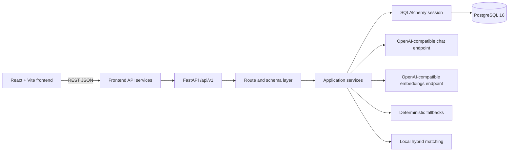

# Architecture

## System overview

Aatmoday Connect is a React/Vite frontend backed by a FastAPI REST API. The API owns interest analysis, profile persistence, recommendation ranking, catalog queries, icebreakers, and feedback. PostgreSQL stores the seeded catalog and user/recommendation state.

The backend also calls configurable OpenAI-compatible chat and embedding endpoints. Interest analysis, embeddings, and icebreakers have deterministic local fallbacks. Recommendation scores and explanations are calculated locally.

## Frontend architecture

- `frontend/src/App.tsx` defines routes for home, discovery, recommendations, groups, events, details, and profile.
- React Query manages server state and retries queries once.
- `src/services` selects API-backed or deterministic mock adapters according to `VITE_API_MODE`.
- `src/services/apiClient.ts` sends JSON requests to `VITE_API_BASE_URL`, applies a 10-second client timeout, and preserves HTTP status/details in `ApiClientError`.
- The frontend uses the stable seeded demo user ID unless `VITE_DEMO_USER_ID` is set.
- Some saved/interested UI state is held in browser `localStorage`; it is not all server persistence.

## Backend architecture

- `app/api/v1`: thin route handlers, dependency wiring, validation, and HTTP status translation.
- `app/schemas`: Pydantic request and response contracts.
- `app/services`: AI, embeddings, matching, recommendations, catalog, profiles, feedback, and icebreakers.
- `app/models`: SQLAlchemy models and relationships.
- `app/db`: engine, session, and declarative metadata.
- `migrations`: Alembic schema history.

`get_db` creates a request-scoped synchronous SQLAlchemy session and closes it in `finally`. Mutating services commit their own transaction. There is no authentication middleware or user session system.

## Request flow

1. The browser calls a frontend service.
2. The service selects the API or mock adapter.
3. In API mode, `ApiClient` sends a JSON request to `/api/v1`.
4. FastAPI validates path, query, and body values with Pydantic.
5. The route resolves a database session and service dependency.
6. The service performs provider calls, database work, or local computation.
7. The route returns the declared direct JSON response model.
8. Validation and service failures become the documented HTTP error shape `{ "detail": "..." }`.

## Recommendation flow

`POST /recommendations` loads the user's persisted interest weights and goals, analyzes the submitted text, persists newly recognized interests, generates one embedding, retrieves up to 100 groups and 100 events, scores candidates locally, sorts them, stores recommendation records, and returns the requested results. Each result contains its persisted recommendation ID, target, score, matched signals, reasons, and explanation.

## AI flow

- Interest analysis uses `StructuredAIService` and a configured chat provider.
- The provider is asked for strict JSON containing interests, goals, traits, and preferences.
- The result is validated, normalized to the controlled vocabulary, and assigned server-side categories.
- Recommendation embeddings use the configured embedding provider.
- Icebreakers call the provider only on demand and include public target data and user interest names.
- Recommendation explanations are generated from score evidence by local deterministic code; there is no AI call per recommendation.

## Error and fallback flow

- Pydantic validation errors return `422`.
- Missing users, groups, events, or recommendations return `404`.
- Duplicate feedback returns `409`.
- Provider-backed rate limits return `429`.
- Unrecoverable provider failures return `502` where the route cannot fall back.
- Recommendation storage failures return `503`.
- The global exception handler returns a generic `500` detail and does not expose provider internals.
- Interest analysis falls back to deterministic keyword matching.
- Embeddings fall back to a deterministic SHA-256-derived 1536-value vector.
- Icebreakers fall back to a short template using shared interests and public target details.

## Runtime boundaries

The API uses explicit CORS origins from `CORS_ORIGINS`. Rate limits are in-memory, per process, and keyed by client host. Database work is synchronous inside FastAPI handlers. Embedding values are JSON arrays, not vector-indexed database values.
